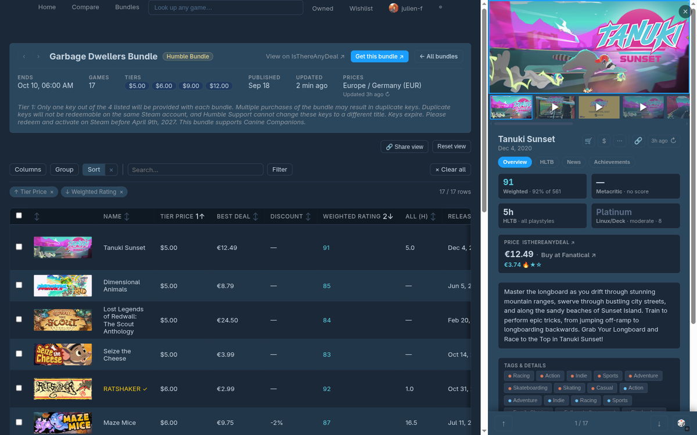
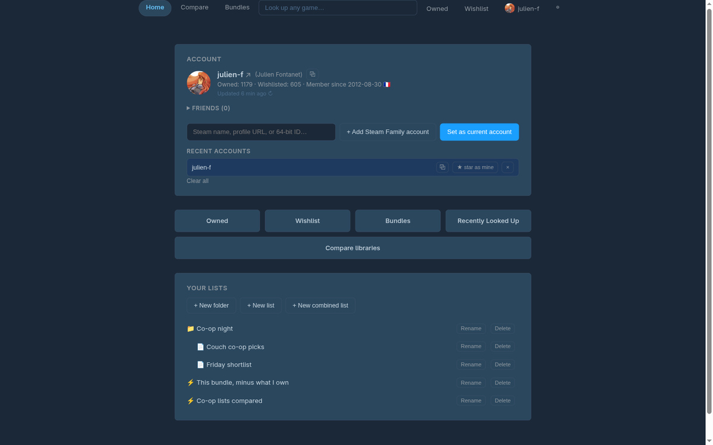
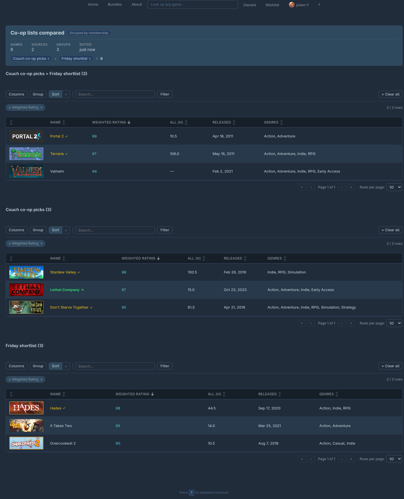
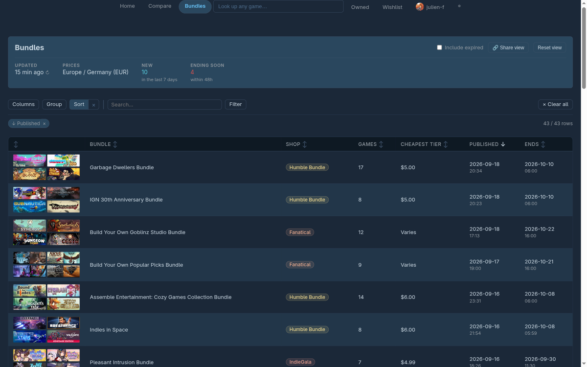
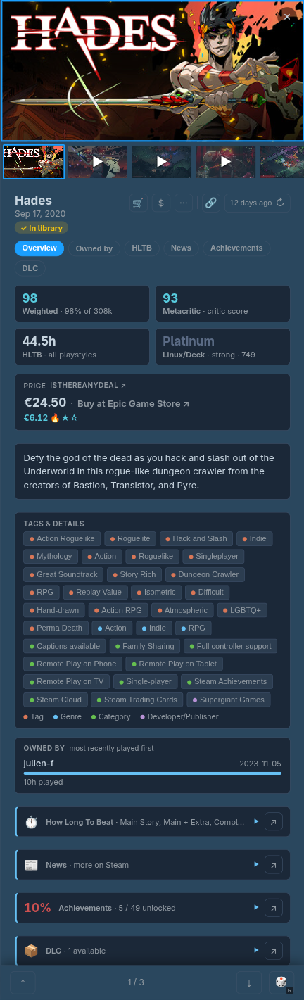

# What the app does

Everything the app shows is a **list of games** — an account's owned games, its wishlist, a bundle, games you looked up, or a list you made yourself — and every list opens in the same viewer: a sortable, filterable, groupable table with a detail panel beside it.

There is no account to create and nothing is stored on the server. The accounts you look at, the lists you build and your preferences all live in your own browser.

- [Accounts](#accounts)
- [Lists](#lists)
  - [Combining lists](#combining-lists)
- [Bundles](#bundles)
- [Prices](#prices)
- [The game panel](#the-game-panel)
- [Sharing](#sharing)
- [Keyboard shortcuts](#keyboard-shortcuts)
- [How fresh is this?](#how-fresh-is-this)

## Accounts

Enter a Steam profile URL, vanity name or 64-bit ID on the home page to explore that account. Several identifiers at once resolve into one **Family** — their libraries are merged, so a game anyone in the family owns counts as owned.

- **Current account** — whoever you're exploring right now. The nav bar always says who that is, with one-click links to their **Owned** and **Wishlist** lists.
- **My account** — star (★) any account in the picker to pin it as your default.
- **Recent accounts** are remembered, and switchable from the nav-bar chip without going back home.
- **⧉ copies an account's Steam identifier** — its custom URL name when it has one (`gaben`), its 64-bit ID otherwise — from the home page's account card, from every account in "Recent accounts" and in the nav-bar chip (one ⧉ per member for a Family). Any remembered account's identifier is one click away, current or not. That's the identifier to hand to someone else, or to paste back into the account field here.

A private profile or wishlist looks identical to an empty one from the outside; the app shows what it can see.

## Lists

- **Owned** and **Wishlist** for the current account, and one list per **bundle** you browse, are always live — never stored, never stale.
- **Recently Looked Up** collects games you searched for, browsable like any other list.
- **Your own lists** come in two kinds: a **manual** list you add and remove games from, and a **dynamic** list defined as a formula over other lists, recomputed every time you open it. A dynamic list can be **frozen** into a manual one, keeping its current contents and dropping the formula.
- Lists live in a **folder tree** you can rename, nest and organize.

### Combining lists

Pick two or more lists and an operation:

- **Union** — everything in any of them.
- **Intersect** — only what they all share.
- **Subtract** — what's in the first but not the others.
- **Group by membership** — one table per combination of sources, so you can see what all three accounts share, what only two do, and so on. Combining several accounts' Owned lists this way is how you compare libraries.

Naming the combined list is optional: leave the name empty and it's called by what it does — "Alice — Owned ∩ Bob — Owned" — in your list tree and on its own page, updating by itself if you later change its sources or rename an account. Type a name whenever you'd rather have one.

The result is a live list: save it as dynamic (it re-resolves each time), or freeze it. A dynamic list's page states its formula, names every source, and says what each contributed.

## Bundles

Browse current Steam game bundles (sourced from IsThereAnyDeal, and only available if the app is configured with an ITAD key). Open one and its games become a list like any other, with the bundle's tier price alongside each game's rating, playtime estimates and current best price anywhere. Games in a bundle with no Steam listing are listed separately below the table rather than quietly dropped.

## Prices

Wishlist and bundle lists carry price columns: the best deal across every shop IsThereAnyDeal tracks, the discount against Steam's full price, and historical lows. A price at or below a record low is badged — 🔥 all-time, ★ one-year, ☆ three-month. Prices are region-specific; pick your region in the nav bar's ⚙ Preferences (it defaults to auto-detecting from your system timezone). Some shops only ever price in USD regardless of region — that's their behaviour, passed through unchanged.

## The game panel

Clicking any row opens a detail panel beside the table — not over it, so the list stays usable and clicking another row just swaps the panel's contents. It carries screenshots and trailers, the weighted rating and review counts, How Long To Beat estimates, achievements, recent news from the developer, current price, DLC and links out. ↻ refetches everything for that one game.

## Sharing

- A game's own link (`/game/<appid>`) opens that game for anyone, whether or not they own it.
- Add `?u=` to any list link to share the account you're exploring. It never changes the recipient's own default account, and a game link deliberately doesn't carry it.
- **🔗 Share view** copies a link with your current table layout — columns, sort, grouping, filters — baked in. The recipient gets it as a starting point; it doesn't override their setup permanently.

## Keyboard shortcuts

Press `?` for the full list. The essentials: `/` focuses search, `Esc` closes what's open, `↑`/`↓` move through the list, `←`/`→` through a game's media, and `R` picks a random game.

## How fresh is this?

Everything is cached, and every screen that shows cached data says how old it is and offers a ↻ to fetch fresh — per account on the home page, per game in the panel, and per list for prices.
